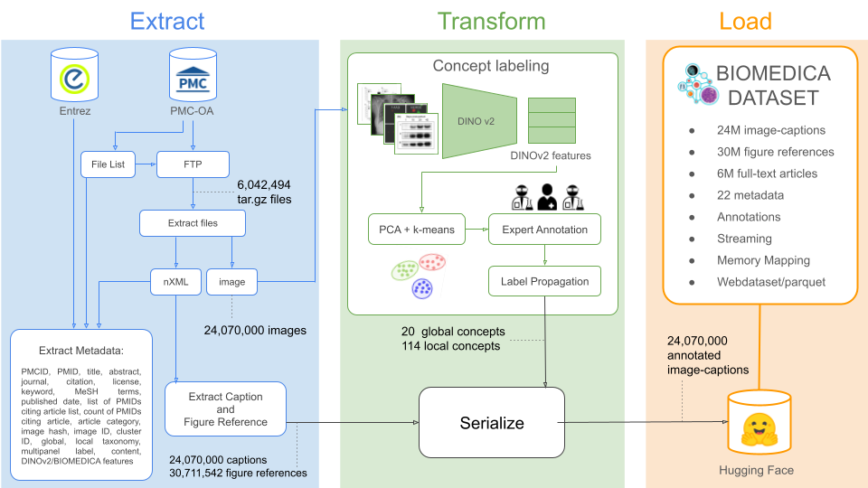
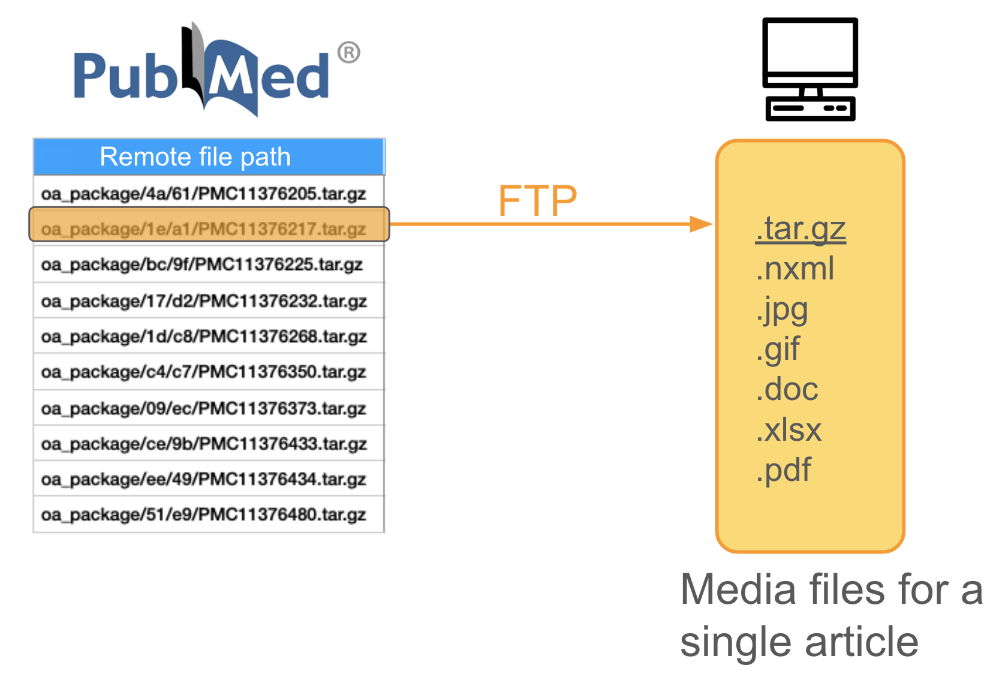

<div align="center">
    
</div>


<p align="center">
  <strong>Arxiv:</strong> <a href="https://arxiv.org/pdf/2501.07171" target="_blank">Arxiv</a> 
  &nbsp;&nbsp;&nbsp;&nbsp;|&nbsp;&nbsp;&nbsp;&nbsp;
  <strong>Website:</strong> <a href="https://minwoosun.github.io/biomedica-website" target="_blank">Biomedica</a>
  &nbsp;&nbsp;&nbsp;&nbsp;|&nbsp;&nbsp;&nbsp;&nbsp;
 <strong>Training instructions:</strong> <a href="https://github.com/Ale9806/open_clip_with_biomedica" target="_blank">OpenCLIP</a>
  

</p>


Tutorial:
[](https://colab.research.google.com/drive/10h2onUZXIRoYyD2FpFqm2FAoUyF2QQka?usp=sharing)

Welcome to the official Biomedica Repository. If you want to start training your biomedical CLIP-style model using 24M scientific articles [click here](https://github.com/Ale9806/open_clip_with_biomedica). If you wish to use our filtering pipeline to get subsets from our labeled dataset on demand [click here](). If you would like to reproduce our dataset read this README file.


### Terminology:

The Biomedica Framework consists of four artifacts:

* ```Biomedica ETL:```
The ETL pipeline used to extract data from PMC-OA, transform (standardize and annotate) the archive into a dataset, and load the resulting archive into Hugging Face.


* ```Biomedica Archive:```
A standardized tape archive  (TAR) encompassing the entirety of PMC-OA (24 million images at the time of this writing). The archive is updated and released annually.


* ```Biomedica Dataset:```
The transformed and annotated archive, made available in a consumable format (either as a WebDataset or Parquet) on Hugging Face.

* ```Biomedica Family of models (BMC-CLIP):```
A family of continually pre-train CLIP-style models using the Biomedica Dataset artifact (as well as filtering pipelines)


We also provide code to train a CLIP-style model leveraging the Biomedica Dataset. The dataset can be filtered on demand using the provided metadata. Additionally, we offer our own trained family of models, BMC-CLIP.

## Pubmed Central Open Access ETL Pipeline

**TL;DR** This  section of the repository contains code for:
1. **Extracting:** Downloading media files (e.g., full text, captions, and images) from the PMC-OA Subset and storing them as JSON files.
2. **Transforming:** Serializing downloaded JSON files into WebDataset format (for fast training) and Parquet format (for efficient filtering).
3. **Loading:** Loading both dataset formats into Hugging Face.

<div align="center">
    
</div>

### Context:
[PubMed Central (PMC)](https://pmc.ncbi.nlm.nih.gov/
) is a full-text archive of biomedical literature managed by the United States National Institutes of Health's National Library of Medicine (NIH/NLM). As the time of this writing PMC archives 
10.5M articles from 2.9K journals. However,  **not** all articles in PMC are available for text mining or other reuse as many are under copyright. To address this, the PMC Open Access Subset offers articles that are made available under Creative Commons or similar licenses, allowing for more liberal redistribution and reuse compared to traditionally copyrighted works. This subset gets updated yearly, highlighting the need for a robust, dedicated pipeline to extract, transform (serialize and label), and load this subset into a deep-learning-ready artifact. In contrast to previously released pipelines, this ETL process extracts and serializes all available metadata while also incorporating additional weekly expert annotations provided by clinicians and biologists.


⚠️ **Warning**: Some steps in this ETL process are CPU-intensive, while others are GPU-intensive. To recreate this archive within a month, we recommend utilizing a SLURM-managed cluster equipped with at least 60 CPUs, 10 A600 GPUs (or equivalent), and a minimum of 50 TB of storage. We do not recommend attempting to run this ETL without the required hardware.

✅ **Important:** Running this ETL pipeline is unnecessary to obtain the latest PMC-OA subset dataset, as our team will provide annual releases. This ETL is shared primarily to ensure replicability.

This ETL is maintained by the [Stanford MARVL](https://marvl.stanford.edu/). If you would like to contribute, please review our community and contribution guidelines and submit a pull request.

## Setting up the environment
First, clone this repository and install [Poetry](https://python-poetry.org/). Once installed, go to this repository in your local machine and run the following commands:

```bash
$ conda create --name pmc-oa python=3.9 -y # Create a python 3.9 environment
$ conda activate pmc-oa                    # Activate environment 
$ poetry install                           # Install dependences using poetry

# [Optional]: If you want to use our pipeline to annotate images (using DINOv2)
# please install a compatible pytorch distribution. In our case, we used:

$ pip3 install torch torchvision torchaudio --index-url https://download.pytorch.org/whl/cu118
```

# 1.- Extracting Pubmed Central Open Access Subset:


### About PMC OA media files:

Article files are retrieved using two distinct PMC FTP services: 

A. **Bulk Download Service:** The bulk download service only contains xml files, providing full-text article data and additional metadata.

B. **Individual Article Download Service:** To get the media files (e.g. images) we have to use the PMC FTP service.

As stated by the [NLM](https://pmc.ncbi.nlm.nih.gov/tools/ftp/):

> "If you only want to download some of the PMC OA Subset based on search criteria or 
if you want to download complete packages for articles that include XML, PDF, media, 
and supplementary materials, you will need to use the individual article download 
packages. To keep directories from getting too large, the packages have been 
randomly distributed into a two-level-deep directory structure. You can use the 
file lists in CSV or txt format to search for the location of specific files or 
you can use the OA Web Service API"

The `oa_file_list.csv` contains a column with the randomized path to the `tar.gz` file for a particular article, e.g. for `PMC11376217` you can get: `oa_package/1e/a1/PMC11376217.tar.gz`. Here is what the FTP process looks like: 
<div align="center">
    
</div>


## Usage: Download Media Files & Extract Data
Throughout this package we will use the directory `data_dir` and will be shared across all the steps below. This is where all temp files and media files will be downloaded to. The default is the `./data` directory in the repo, but you can choose a different directory path.

1. **Download filelist**: Download the file list that contains the remote path to the media files. We will iterate through each row of this list (each row is one article) to download the files for each article in step 3. Running the following script will download the main file list and split them by license type (commercial, noncommercial, other) and output separate file lists:

```bash
python scripts/01_download_filelists.py
```

2. **Batching**: Note that the full file list contains over 6M articles (June, 2024). Here's the breakdown by license type (this can change based on when you download):
    - `commercial`: 4.2M articles 
    - `noncommercial`: 1.6M articles
    - `other`: 414k articles
Since this is a lot of articles to process at once, you can parallelize the operation by creating smaller subsets of the file list. 

> **WARNING**: NCBI allows 3 API calls per second, so take this into account when processing batches in parallel. Here is how you create subsets of the file list for each license type:

```bash
batch_count=3

python scripts/02_batch_filelist.py --file_list_path data/file_lists/filelist_commercial.csv --output_dir data/file_lists/commercial/ --batch_count $batch_count
python scripts/02_batch_filelist.py --file_list_path data/file_lists/filelist_noncommercial.csv --output_dir data/file_lists/noncommercial/ --batch_count $batch_count
python scripts/02_batch_filelist.py --file_list_path data/file_lists/filelist_other.csv --output_dir data/file_lists/other/ --batch_count $batch_count
```

3. **Download media files**: 
To process multiple batches in parallel with multiple compute nodes, create a shell script like `scripts/03_download_batch_ftp.sh` (with configurations matching your own compute system) and choose the appropriate license type (parameter LICENSE). This runs `03_download_batch_ftp.py` for the 3 batches created from the previous step. We used a shell script to submit sbatch jobs since this process will take days. In our case, we run,
```bash
bash scripts/03_download_batch_ftp.sh # default commercial
```
Make sure to change the license type in the shell script! 


4. **Build JSON: Extract meta data and captions from nXML** 
Once all the media file files including the full article text (nXML file) and image files are downloaded, we extract the necessary article information and store them in JSON files.  Here is the dictionary structure for an example article:

```
{
'accession_id': 'PMC176545',
'citation': 'PLoS Biol. 2003 Oct 18; 1(1):e5',
'license': 'CC BY',
'date': '2023-01-25 15:10:10',

...

'figureset':  [
                {
                    'image_id': 'image1',
                    'image_file_name': 'image1.jpg',
                    'caption': '...caption...',
                    ...
                },
                {
                    'image_id': 'image1',
                    'image_file_name': 'image1.gif'
                    'caption': '...caption...',
                    ...
                }
             ]
}

```

Here is an example of how to go from a file list (batched from step 2) to generating json files containing data for the articles contained in the file list. `--filelist_batch_dir` is the directory that contains all the batched file lists and to process batch `--batch_idx`. All the json files will be outputted to `data/json/`. We recommed parallelizing this process with as much compute resource available, especially as we do not need to make any API calls with rate limits at this step. We run `scripts/04_build_json.py` in parallel by the running the following shell script. Note that we set the batch size for json files to be max 200 by default. This is because we can query up to 200 articles at a time for Entrez in the next step.

Make sure to change the license type in the shell script! 

```bash
bash scripts/04_build_json.sh # default commercial
```

5. **Retrieve Entrez meta data**
To use the Entrez API, you first need to register your email and set an API key through https://account.ncbi.nlm.nih.gov/. After logging in with an email, go to account settings, then `API Key Management`. You can query article meta data in batch--up to 200 articles at a time. In this section, the goal is to iterate through each json file, open the list of article dictioanries, run the query on the articles (based on pmids), include the the query data as key value pairs, and output a new json file. We first create csv files that contain paths to the json files we want to process,
```bash
python scripts/05a_file_path_batching.py
```
This script creates the `data/entrez/` directory and store the generated csv files. We then run `scripts/05_json_to_entrez.py`, which submits the Entrez queries. In our case, we submit an sbatch job using a shell script.
```bash
sbatch scripts/05b_json_to_entrez_batch.sh 
```
You can use `scripts/05c_remaining_json.py` to copy over json files that failed to retrieve Entrez data.

JSON files after including the Entrez data are stored in `data/json_entrez/`.


# 2 .-Transforming:
The next step after downloading PMC-OA is to serialize it. This step is essential because using the raw JSON files for either training a large deep learning model or analyzing the data is suboptimal. The serialization protocol depends on our specific needs. As a rule of thumb, if we aim to decrease idle GPU time, working with a dataset stored as a WebDataset is preferable. This format is crucial for achieving high I/O rates from local storage (3x–10x faster for local drives compared to random access). On the other hand, if we want to analyze, filter, or use a subset of our large dataset, the Parquet format is a better choice.

To address both scenarios, our serialization process provides these two formats. However, to fully leverage the high I/O rates of WebDatasets, we must first serialize the dataset into this format. Subsequently, we serialize it into Parquet using Hugging Face Datasets.

## Usage: Serialization into webdataset & parquet

#### 2.1 Webdataset Serialization:
⚠️ **Warning:** This step must be parallelized; otherwise, it would take approximately 150 days to serialize the dataset. To expedite the process, we will submit 600 CPU-intensive jobs (each lasting between 1 to 12 hours, depending on the subset) to complete serialization in under 24 hours. Therefore, please be mindful of other users when working on a shared cluster.

To serialize the archive into a webdataset format please select the subset you would like to sterilize using the **subset variable**  (select one of "other", "commercial", "noncommercial" ) within "06_serilaize_to_webdataset_parallel.sh". Then run:

```bas
06_serilaize_to_webdataset_parallel.sh
```

If sufficient compute resources are available, this step will be completed in approximately 15 hours.


#### 2.2 Paequet Serialization:
Within each subset, this step cannot be parallelized as Hugging Face does not currently provide support. To serialize the archive into Parquet format, please select the subset you wish to serialize by setting the name variable (choose from "other," "commercial," or "noncommercial") within the "07_serialize_to_parquet.sh" script. Then run:

```bas
07_serilaize_to_parquet.sh
```

If sufficient compute resources are available, this step will be completed in approximately 24 hours.


# 3.- Loading Serialized PMC-OA Subset to HuggingFace:
To upload the serialized datasets to Hugging Face, you need to (a) create a Huggingface dataset repository, (b) copy the dataset name, (c) edit the dataset_name variable, and (3)  run the following scripts:

**Webdataset Upload:**  

```bash
09a_upload_webdataset_to_HF.sh
```

**Parquet Upload:**  

```bash
09b_upload_parquet_to_HF.sh
```


## Contributing

Interested in contributing? Check out the contributing guidelines. Please note that this project is released with a Code of Conduct. By contributing to this project, you agree to abide by its terms.

## License

This repository `pmc_oa` was created by Min Woo Sun and Alejandro Lozano. It is licensed under the terms of the MIT license. 

License for PMC terms vary. Please refer to the license statement in each article for specific terms of use.

Within the PMC Open Access Subset, there are three groupings based on available license terms:

- Commercial Use Allowed - CC0, CC BY, CC BY-SA, CC BY-ND licenses;
- Non-Commercial Use Only - CC BY-NC, CC BY-NC-SA, CC BY-NC-ND licenses; and
- Other - no machine-readable Creative Commons license, no license, or a custom license.

## Credits

`pmc_oa` was created with [`cookiecutter`](https://cookiecutter.readthedocs.io/en/latest/) and the `py-pkgs-cookiecutter` [template](https://github.com/py-pkgs/py-pkgs-cookiecutter).


## Acknowledgments
This research was supported by NIH grants (NIH#P30AG066515 to JJN), the Chan Zuckerberg Initiative Neurodegeneration Challenge Pairs Pilot Project to SYL (2020-221724, 5022), the Wu Tsai Knight Initiative
Innovation grant (#KIG 102) to SYL, Hoffman-Yee Research Grant to SYL, the Arc Institute Graduate Fellowship to AL, the Stanford Data Science Graduate Research Fellowship MW, and the Quad Fellowship to JB, and. SYL is a Chan Zuckerberg Biohub – San Francisco Investigator.

We  thank Daniel van Strien, Matthew Carrigan, and Omar Sanseviero from Hugging Face for their invaluable assistance with data upload and design planning on the Hugging Face platform.

We thank [Jorge Velasquez](https://www.behance.net/tlalcalli) for the logo design.

## Citation

```
  @misc{lozano2025biomedicaopenbiomedicalimagecaption,
      title={BIOMEDICA: An Open Biomedical Image-Caption Archive, Dataset, and Vision-Language Models Derived from Scientific Literature}, 
      author={Alejandro Lozano and Min Woo Sun and James Burgess and Liangyu Chen and Jeffrey J Nirschl and Jeffrey Gu and Ivan Lopez and Josiah Aklilu and Austin Wolfgang Katzer and Collin Chiu and Anita Rau and Xiaohan Wang and Yuhui Zhang and Alfred Seunghoon Song and Robert Tibshirani and Serena Yeung-Levy},
      year={2025},
      eprint={2501.07171},
      archivePrefix={arXiv},
      primaryClass={cs.CV},
      url={https://arxiv.org/abs/2501.07171}, 
}
```

## Star History

[](https://star-history.com/#minwoosun/biomedica-etl&Date)
